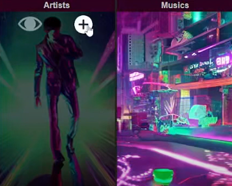
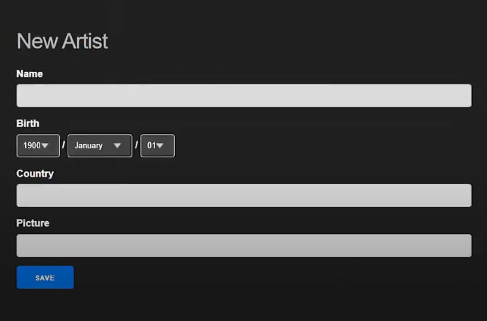
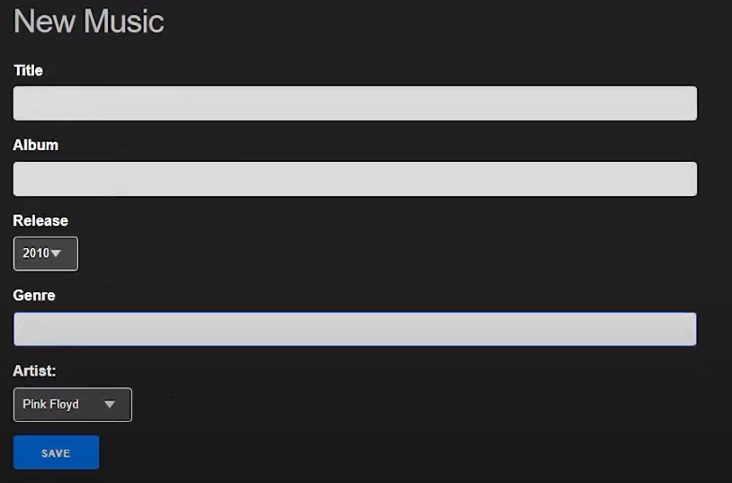
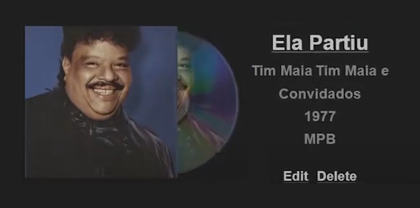

# DES - Discografia Eclética e Supimpa (Eclectic and Awesome Discography)

 (Image: DES logo)

Simple website using the framework Phoenix and the language Elixir. DES can edit, remove and update artists and musics that can be created by the user. This project was used as the Funcional Programming's class final project at the Federal University of Paraiba (UFPB), at the request of the professor Andrei Formiga, from the Scientific Computer Departament (DCC) of the Informatics Center (CI), UFPB.

## How to Run
To start your Phoenix server:

  * Install dependencies with `mix deps.get`
  * Create and migrate your database with `mix ecto.setup`
  * Start Phoenix endpoint with `mix phx.server` or inside IEx with `iex -S mix phx.server`

Now you can visit [`localhost:4000`](http://localhost:4000) from your browser.

<!--
Ready to run in production? Please [check phoenix deployment guides](https://hexdocs.pm/phoenix/deployment.html).

## Learn more about Phoenix
  * Official website: https://www.phoenixframework.org/
  * Guides: https://hexdocs.pm/phoenix/overview.html
  * Docs: https://hexdocs.pm/phoenix
  * Forum: https://elixirforum.com/c/phoenix-forum
  * Source: https://github.com/phoenixframework/phoenix
-->

## How to Create Elements

  (Image: homepage screen banners)

### How to create an artist
- You can create an artist by going to the artist banner on the homepage and cliclikng the "+" button.
- Then, you should type the artist data: Name, Birth, Country and the url for a image.

 (Image: artist creation screen)

### How to create a music
- You can create a music by going to the music banner on the homepage and cliclikng the "+" button.
- Then, you should type the music data: Music title, Album, Release year, Genre and Artist.
- Note: Keep in mind that to create a music, you should create the music artist first.

 (Image: music creation screen)

## How see the created data
- You can list all artists or musics by cliclikng the "eye" button on the artist or music banner on the homepage.

     (Image: listing musics screen)

## Authors
 - [@Diego Reis](https://www.github.com/diegolrs)
 - [@Eduarda Donato](https://github.com/Eduarda-Donato)
 - [@Samantha Medeiros](https://github.com/sammid37)
